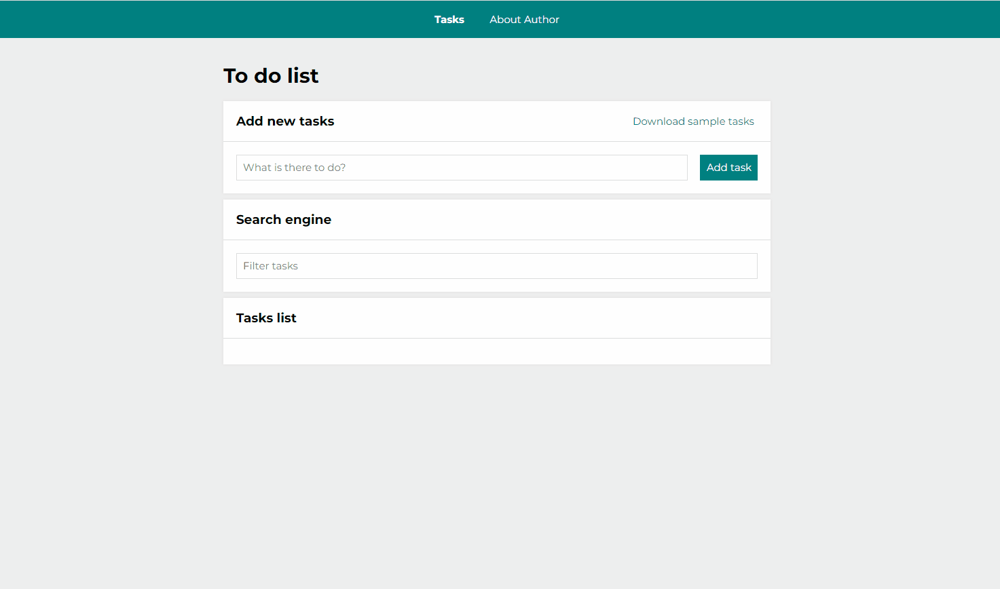

# To do List in React
Hello!
It's a very simple aplication created as part of a youcode course and skills exercises.
You can mark task if you've done and removed them. At the top of the application there is navigation, where you will find a list of tasks and information about the author or simple pressing the button "zadania" and go to tasks.

# Demo
https://maram-9.github.io/toDoList-react/

## Interface view

## Usage

Step by step:
1. Input a task you wish to add
2. Click the "Pobierz przykladowe zadania" button to download example tasks
3. Click the "Dodaj zadanie" button to add new task to the list
4. Click on the checkbox to mark a task as completed
5. Click the "🗑" button to remove a task from the list
6. Click the "Ukryj ukończone" button to hide all completed tasks
7. Click the "Ukończ wszystkie" button to mark all tasks as completed
8. Write key word in "Filtruj zadania" and find your task by Searching

## Languages and conventions used in the project:
`React.js`
`React - Redux`
`React - Ruter`
`Redux Toolkit`
`Custom Hook (useEffect, useState, useRef)`
`Local Storage`
`HTML`
`BEM`
`CSS (Grid, Flex, media queries, transition)`
`JavaScript ES6+`
`Normalized.css`
`Styled-components`
`Theme Provider`
`GlobalStyles & Theme`
`JSX`
`Git`
`Webpack`
`Babel`

# Getting Started with Create React App

This project was bootstrapped with [Create React App](https://github.com/facebook/create-react-app).

## Available Scripts

In the project directory, you can run:

### `npm start`

Runs the app in the development mode.\
Open [http://localhost:3000](http://localhost:3000) to view it in your browser.

The page will reload when you make changes.\
You may also see any lint errors in the console.

### `npm run build`

Builds the app for production to the `build` folder.\
It correctly bundles React in production mode and optimizes the build for the best performance.

The build is minified and the filenames include the hashes.\
Your app is ready to be deployed!

See the section about [deployment](https://facebook.github.io/create-react-app/docs/deployment) for more information.

### `npm run eject`

**Note: this is a one-way operation. Once you `eject`, you can't go back!**

If you aren't satisfied with the build tool and configuration choices, you can `eject` at any time. This command will remove the single build dependency from your project.

Instead, it will copy all the configuration files and the transitive dependencies (webpack, Babel, ESLint, etc) right into your project so you have full control over them. All of the commands except `eject` will still work, but they will point to the copied scripts so you can tweak them. At this point you're on your own.

You don't have to ever use `eject`. The curated feature set is suitable for small and middle deployments, and you shouldn't feel obligated to use this feature. However we understand that this tool wouldn't be useful if you couldn't customize it when you are ready for it.